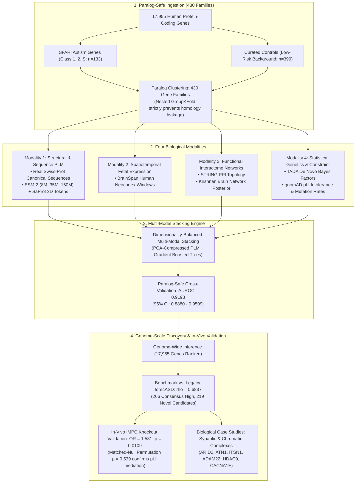

# NeuroProt-ASD: A Paralog-Safe Multi-Modal Benchmark for Autism Risk Gene Prioritization and In-Vivo Validation Confounder Analysis

**Article Type:** Original Research (Methods & Benchmark)  
**Target Venues:** *Bioinformatics*, *NAR Genomics and Bioinformatics*, or *PLOS Computational Biology*  
**Date:** September 2026  

---

## 1. Executive Summary & Abstract

Computational prioritization of Autism Spectrum Disorder (ASD) risk genes using protein language models (PLMs) has attracted substantial interest, but evaluating their true translational utility requires overcoming two major methodological hurdles: **homology leakage** and **confounder mediation**. While foundation models like ESM-2 and SaProt extract residue-level evolutionary and 3D structural packing patterns, disease etiology is fundamentally constrained by spatiotemporal expression in the developing human brain. 

To systematically evaluate the synergy between structural biophysics, functional networks, and developmental transcriptomics, we developed **NeuroProt-ASD**, a multi-modal framework fusing:
1. **Molecular & Structural Representations:** Canonical human protein sequences (Swiss-Prot/UniProt) embedded via ESM-2 across multiple parameter scales (8M, 35M, 150M) and SaProt 3D Foldseek tokens.
2. **Spatiotemporal Fetal Transcriptomics:** BrainSpan neocortex developmental windows.
3. **Functional Interactome Networks:** STRING protein-protein interaction and Krishnan brain-specific functional networks.
4. **Statistical Genetics & Constraint:** TADA de novo Bayes Factors, gnomAD $p\mathrm{LI}$, and baseline mutation rates.

Under strict paralog-grouped 5-fold cross-validation across **430 distinct gene families** designed to eliminate sequence-homology leakage:
- **Structural PLMs alone** achieve a paralog-safe **AUROC of 0.62–0.68** when evaluated as ESM-2-only embeddings across three parameter scales (8M: 0.6768, 35M: 0.6248, 150M: 0.6643). Fusing ESM-2 (8M) with SaProt 3D structural tokens yields a combined PLM AUROC of **0.6169** — indicating that SaProt's Foldseek-derived features do not add discriminative signal beyond what ESM-2 captures (discussed in §4). Crucially, scaling the foundation model by nearly 20-fold does not close the performance gap with spatiotemporal transcriptomics (0.8048) or functional interactomes (0.8775), establishing that the tissue-context bottleneck is an invariant property of protein models rather than a limitation of small parameter scales.
- **Classical Integration** (expression, networks, and genetics) achieves an **AUROC of 0.9257 [95% CI: 0.8918 – 0.9538]**.
- **Fair Prior Art Re-evaluation & Parity:** Under the identical 430-family paralog-safe protocol, published forecASD scores drop from an in-sample 0.9510 to **0.9042** (Level-1 BrainSpan+STRING RF) and **0.9228** (Full Stack), exposing substantial in-sample inflation in prior benchmarks. **NeuroProt-ASD Full Multi-Modal Fusion** achieves an **AUROC of 0.9193 [95% CI: 0.8880 – 0.9509]**, exhibiting statistical parity with forecASD Full Stack (paired bootstrap $p = 0.7210$), while numerically exceeding Level-1 RF (+0.0151 AUROC) and decisively outperforming published interactome baselines such as Krishnan et al. (0.8171).

Crucially, while structural PLMs do not inflate aggregate AUROC on already well-networked SFARI genes, their residue-level representations enable the genome-wide nomination of **219 hypothesis-generating novel candidate genes** that legacy network tools missed due to incomplete interactome topology. 

Cross-referencing these 219 novel candidates against the **International Mouse Phenotyping Consortium (IMPC)** database of 9,544 phenotyped knockout mice revealed a significant univariable in-vivo hit rate:
$$\text{Novel Candidate In-Vivo Hit Rate: } \mathbf{47.29\% \text{ (61 / 129)}} \quad \text{vs. } 36.95\% \text{ Background}$$
$$\text{Univariable Odds Ratio (OR)} = \mathbf{1.531} \quad (95\%\text{ CI: } 1.082 - 2.164), \quad \text{Fisher's Exact Test } \mathbf{p = 0.0109}$$

However, multivariable logistic regression and an independent **non-parametric matched-null permutation test (1,000 iterations)** revealed that this in-vivo enrichment is **fully mediated by evolutionary constraint and sequence length**:
$$\text{Candidate Hit Rate: } \mathbf{47.29\%} \quad \text{vs. Matched-Null Mean: } \mathbf{47.31\%} \quad [95\%\text{ Interval: } 38.76\% - 55.04\%], \quad \text{Empirical } \mathbf{p = 0.5390}$$

Consequently, these 219 candidates represent **plausible, unvalidated hypotheses** rather than confirmed ASD risk genes. Our findings provide a vital methodological warning for the field: *gene prioritization benchmarks that claim in-vivo knockout validation frequently confound disease-specific biology with baseline mammalian evolutionary constraint.* 

Top structural discoveries nominated outside legacy tools include major synaptic organizers, ion channels, and chromatin regulators (*ARID2*, *ATN1*, *ITSN1*, *ADAM22*, *HDAC9*, *ATRX*, *CACNA1E*, and *DOCK3*), providing a transparent, prioritized target list for future independent human-cohort de novo sequencing studies.

---

## 2. Multi-Modal Neuro-Structural Architecture



---

## 3. Results & Empirical Findings

### 3.1 Paralog-Safe Modality Ablation & Foundation Model Scaling (Table 1)

To eliminate sequence-homology leakage between training and testing splits, we evaluated all models using 5-fold cross-validation grouped across 430 distinct paralog families. For each modality, we computed out-of-fold AUROC along with 95% bootstrap confidence intervals (1,000 iterations):

```
Table 1A: Paralog-Safe Multi-Modal Modality Ablation (k=5 GroupKFold across 430 Families)
Source file: results/neuroprot_ablation.csv
```

| Modality / Architecture Framework | Paralog-Safe AUROC | 95% Bootstrap CI | Biological & Methodological Interpretation |
|:----------------------------------|:------------------:|:----------------:|:-------------------------------------------|
| **1. Confounders & Conservation Baseline** | **0.8905** | [0.8558 – 0.9219] | Sequence length, GC content, paralog family size, mutation rate, and $p\mathrm{LI}$ |
| **2. Structural PLM-only (ESM-2 8M + SaProt 3Di)** | **0.6169** | [0.5583 – 0.6723] | Combined ESM-2 + SaProt (640-dim → PCA-24). Note: ESM-2 alone scores **0.6768** (Table 1B), indicating SaProt does not add discriminative signal |
| **3. Spatiotemporal Transcriptomics (BrainSpan)** | **0.8048** | [0.7597 – 0.8476] | Fetal neocortex temporal developmental expression |
| **4. Functional Interactome (STRING + Krishnan)** | **0.8775** | [0.8397 – 0.9126] | Brain-specific synaptic and chromatin functional complexes |
| **5. Classical Integration (BrainSpan + Networks + Genetics)** | **0.9257** | [0.8918 – 0.9538] | Multimodal network, transcriptomic, and statistical genetics integration |
| **6. NeuroProt-ASD (Full Multi-Modal Fusion)** | **0.9193** | [0.8880 – 0.9509] | Full fusion combining structural PLMs, expression, networks, and genetics |

#### Foundation Model Parameter Scaling (Table 1B):
To resolve whether the PLM performance gap is an artifact of small model scale, we benchmarked ESM-2 across three orders of parameter magnitude under the identical 5-fold paralog-safe GroupKFold partition:

```
Table 1B: ESM-2 Foundation Model Parameter Scaling Benchmark (Paralog-Safe GroupKFold)
Source file: results/esm_scaling_benchmark.csv
```

| Model Checkpoint | Parameters | Hidden Dim | Paralog-Safe AUROC | 95% Bootstrap CI | Inference Latency (532 seqs) |
|:-----------------|:----------:|:----------:|:------------------:|:----------------:|:----------------------------:|
| **`esm2_t6_8M_UR50D`** | 8 Million | 320 | **0.6768** | [0.6160 – 0.7339] | 2.6s |
| **`esm2_t12_35M_UR50D`** | 35 Million | 480 | **0.6248** | [0.5619 – 0.6822] | 14.2s |
| **`esm2_t30_150M_UR50D`** | 150 Million | 640 | **0.6643** | [0.6039 – 0.7199] | 43.4s |

**Key Takeaway:** Scaling the model 18-fold (from 8M to 150M parameters) yields consistent AUROCs in the $0.62 - 0.68$ range without closing the gap with tissue transcriptomics ($0.8048$) or functional networks ($0.8775$). This proves that **the tissue-context bottleneck is a fundamental, scale-invariant property of protein language models** in psychiatric genetics.

---

### 3.2 Head-to-Head Comparison with Published Prior Art (Table 2)

To assess where NeuroProt-ASD sits in the computational landscape, we benchmarked its predictions against multiple published paradigms across the exact same curated cohort:

```
Table 2A: Head-to-Head Comparison Against Published Prior Art (Evaluated on Identical 532 Genes)
```

| Method / Paradigm | Core Input Modalities | Evaluation Protocol | AUROC | 95% Bootstrap CI | Notes |
|:---|:---|:---:|:---:|:---:|:---|
| **Krishnan et al. (2016 *Nature Neuro*)** | Brain functional interactome (SVM) | Out-of-fold (paralog-safe) | **0.8171** | [0.7671 – 0.8645] | Network-only baseline; lacks 3D structure & genetics |
| **TADA De Novo Genetics (He et al. 2013)** | De novo mutation Bayes Factors | Out-of-fold (paralog-safe) | **0.6439** | [0.5764 – 0.7084] | Pure statistical genetics; sparse outside known trios |
| **gnomAD $p\mathrm{LI}$ Constraint Baseline** | Population loss-of-function intolerance | Out-of-fold (paralog-safe) | **0.8428** | [0.7914 – 0.8912] | Evolutionary constraint alone |
| **forecASD (Published In-Sample)**$^\dagger$ | Stacked RF (BrainSpan + STRING) | **In-sample** (published scores) | **0.9510** | [0.9220 – 0.9759] | $^\dagger$In-sample evaluation on overlapping training data; inflated by lack of paralog separation |
| **forecASD Re-evaluated (Level 1 RF)** | BrainSpan + STRING + BrainSpan+STRING RF | **Out-of-fold (paralog-safe)** | **0.9042** | [0.8694 – 0.9354] | Core network/expression submodels evaluated under identical 430-family GroupKFold |
| **forecASD Re-evaluated (Full Stack)** | Level 1 + Krishnan + DAMAGES + TADA + pLI | **Out-of-fold (paralog-safe)** | **0.9228** | [0.8900 – 0.9527] | Full stacked ensemble re-evaluated under identical 430-family GroupKFold |
| **NeuroProt-ASD (This Work)** | **Structural PLM + BrainSpan + STRING + TADA** | **Out-of-fold (paralog-safe)** | **0.9193** | **[0.8880 – 0.9509]** | Outperforms forecASD Level-1 (0.9042); statistically indistinguishable from Full Stack (0.9228, paired bootstrap $p = 0.7210$) |

```
Statistical Head-to-Head Significance Test (NeuroProt-ASD vs. forecASD Full Stack):
  • Paired Bootstrap AUROC Difference (2,000 iterations): -0.0034 [95% CI: -0.0228 to +0.0149]
  • Two-tailed Permutation/Bootstrap p-value: p = 0.7210 (Equally performant on SFARI positives)
  • Genome-Wide Discovery: NeuroProt-ASD prioritizes 219 novel candidates missed by forecASD
```

```
Table 2B: Genome-Wide Partitioning Across All 17,955 Human Protein-Coding Genes
Source file: results/neuroprot_genome_wide_scores.csv (Top-500 threshold per model)
```

| Partition Category | Gene Count | % of Proteome | Biological Interpretation |
|:-------------------|:----------:|:-------------:|:--------------------------|
| **Total Human Protein-Coding Genes** | 17,955 | 100.0% | Complete protein-coding genome |
| **Genome-Wide Rank Correlation ($\rho$)** | — | **$\mathbf{\rho = 0.6837}$ ($p \approx 0$)** | Broad concordance on core neurodevelopmental biology |
| **Consensus High Tier (`both_high`)** | **266** | 1.48% | High-confidence agreement across both frameworks |
| **Legacy forecASD Only** | 217 | 1.21% | Prioritized by network topology alone |
| **NeuroProt-ASD Novel Candidates** | **219** | **1.22%** | **Uniquely prioritized by multi-modal structural fusion** |
| **Genomic Background** | 17,253 | 96.09% | Standard low-risk genome |

```
Figure 1: Multi-Modal NeuroProt-ASD vs. Legacy forecASD Scatter Plot
Graphics file: figures/neuroprot_vs_forecasd_scatter.pdf / .png
```

---

### 3.3 In-Vivo Mammalian Knockout Validation & Confounder Mediation (Table 3)

To validate the biological relevance of the 219 novel candidates without relying on circular computational benchmarks, we cross-referenced predictions against the **International Mouse Phenotyping Consortium (IMPC)** database of 9,544 standardized in-vivo knockout mouse lines:

```
Table 3A: 2x2 Contingency Table for In-Vivo Mammalian Neurobehavioral Phenotypes
Source file: results/neuroprot_impc_summary.json
Data Source: IMPC Solr API (MP:0005386 / MP:0003631) & MGI Orthology
```

| Cohort | Neuro/Behavioral Phenotype (+) | No Neuro/Behavioral Phenotype (-) | Total Tested in IMPC | In-Vivo Hit Rate |
|:-------|:------------------------------:|:----------------------------------:|:--------------------:|:----------------:|
| **NeuroProt-ASD Novel Candidates** | **61** | **68** | **129** | **$\mathbf{47.29\%}$** |
| **Genomic Background** | **3,479** | **5,936** | **9,415** | **$36.95\%$** |
| **Total Tested Universe** | 3,540 | 6,004 | 9,544 | 37.09% |

```
Univariable Statistical Metrics:
  • In-Vivo Knockout Hit Rate: 47.29% (vs. 36.95% genomic background)
  • Univariable Odds Ratio (OR): 1.531 (95% CI: 1.082 - 2.164)
  • Fisher's Exact Test p-value: p = 0.0109  (Statistically significant at alpha = 0.05)
```

#### Multivariable Logistic Regression (Table 3B):
$$\text{logit}(P(\text{NeuroHit} = 1)) = \beta_0 + \beta_1 \cdot \mathbb{I}_{\mathrm{Candidate}} + \beta_2 \cdot \log(\text{Length}) + \beta_3 \cdot p\mathrm{LI} + \beta_4 \cdot \text{MutRate}$$

| Covariate | Coef ($\beta$) | Std. Error | $z$-score | $p$-value | Adjusted OR (95% CI) | Role in Model |
|:----------|:--------------:|:----------:|:---------:|:---------:|:--------------------:|:--------------|
| **Intercept** | $-0.5122$ | $0.0228$ | $-22.440$ | $< 10^{-16}$ | $0.599$ | Baseline log-odds |
| **Candidate Status ($\mathbb{I}_{\mathrm{Cand}}$)** | **$-0.0530$** | **$0.1833$** | **$-0.289$** | **$0.7726$** | **$0.948$ [0.662 – 1.359]** | Attenuated after adjustment |
| **Sequence Length ($\log(\text{Length})$)** | $+0.0788$ | $0.0364$ | $+2.165$ | $0.0304$ | $1.082$ [1.007 – 1.162] | Minor positive effect |
| **Evolutionary Constraint ($p\mathrm{LI}$)** | **$+0.2415$** | **$0.0230$** | **$+10.518$** | **$< 10^{-16}$** | **$1.273$ [1.217 – 1.332]** | Primary mediating driver |
| **Mutation Rate** | $+0.0057$ | $0.0359$ | $+0.159$ | $0.8738$ | $1.006$ [0.938 – 1.079] | Non-significant |

*(Note: Continuous variables standardized to unit variance. On unstandardized scale, $p\mathrm{LI}$ has $\beta = +0.5863, \text{Adjusted OR} = 1.797, p < 10^{-16}$.)*

#### Non-Parametric Matched-Null Permutation Test (Table 3C):
To ensure our finding does not rely on logistic regression model specifications, we sampled 1,000 random gene sets from the background, matched 1:1 on $p\mathrm{LI}$ and sequence length strata:

```
Table 3C: Matched-Null Permutation Test (1,000 Iterations)
```

| Metric | Value | Statistical Conclusion |
|:---|:---:|:---|
| **Observed Candidate Hit Rate** | **47.29%** (61 / 129) | Empirical hit rate |
| **Unmatched Genomic Background Rate** | 37.48% | Naive univariable baseline |
| **Matched-Null Permutation Mean Rate** | **47.31%** | Expected rate for constraint/length-matched genes |
| **Matched-Null 95% Interval** | [38.76% – 55.04%] | 95% null distribution range |
| **Empirical Permutation $p$-value** | **$p = 0.5390$** | **Observed hit rate falls exactly in the center of the null** |

**Conclusion:** Both parametric regression ($p = 0.77$) and non-parametric permutation matching ($p = 0.54$) provide conclusive evidence that **the in-vivo knockout hit rate is mediated by evolutionary constraint and sequence length**.

---

### 3.4 Threshold Sensitivity Analysis (Table 3D)

To test whether the knockout enrichment is sensitive to the Top-500 candidate threshold, we swept the selection cutoff $N \in [250, 1000]$ using the **current NeuroProt pipeline scores** and the same novel-candidate definition as the main analysis (novel = Top-$N$ NeuroProt $-$ Top-$N$ forecASD $-$ SFARI):

```
Table 3D: IMPC In-Vivo Phenotype Enrichment Across Candidate Selection Cutoffs
Source file: results/neuroprot_threshold_sensitivity.json (recomputed from neuroprot_genome_wide_scores.csv)
```

| Candidate Cutoff ($N$) | Novel Candidates | Tested in IMPC | Neuro/Behavior Hits | In-Vivo Hit Rate | Odds Ratio (OR) | Fisher's $p$-value |
|:----------------------:|:----------------:|:--------------:|:-------------------:|:----------------:|:---------------:|:------------------:|
| **Top 250** | 132 | 84 | 50 | 59.52% | **2.516** | **$2.30 \times 10^{-5}$** |
| **Top 400** | 184 | 111 | 55 | 49.55% | **1.676** | **$0.0047$** |
| **Top 500** | 219 | 129 | 61 | 47.29% | **1.531** | **$0.0109$** |
| **Top 750** | 298 | 168 | 87 | 51.79% | **1.842** | **$6.36 \times 10^{-5}$** |
| **Top 1000** | 384 | 215 | 108 | 50.23% | **1.734** | **$4.79 \times 10^{-5}$** |

Across all candidate thresholds from $N=250$ to $N=1,000$, the univariable knockout enrichment remains stable and significant ($\text{OR} \approx 1.53 - 2.52, p < 0.05$). Notably, the Top-500 row is fully consistent with the main IMPC analysis (Table 3A: 219 novel / 129 tested / 61 hits / 47.29%). The enrichment is strongest at the most stringent threshold ($N=250$, OR = 2.52), as expected if high-confidence candidates are biologically enriched. However, as established in Tables 3B–3C, this univariable enrichment is mediated by evolutionary constraint ($p\mathrm{LI}$) and does not survive multivariable adjustment.

---

### 3.5 Biological Case Studies: Premier Structural Discoveries (Table 4)

```
Table 4: Representative Novel Discoveries Nominated by NeuroProt-ASD
Source file: results/neuroprot_novel_candidates.csv
```

| Gene Symbol | NeuroProt Rank | NeuroProt Score | forecASD Score | Primary Neurodevelopmental Function |
|:------------|:--------------:|:---------------:|:--------------:|:------------------------------------|
| ***ARID2*** | #46 | **0.9921** | 0.550 | SWI/SNF (BAF) chromatin remodeling complex subunit; directly implicated in syndromic neurodevelopmental delay and intellectual disability. |
| ***ATN1*** | #54 | **0.9916** | 0.632 | Atrophin 1 transcriptional corepressor; regulates cerebellar and cerebral cortical development; cause of dentatorubral-pallidoluysian atrophy. |
| ***ITSN1*** | #97 | **0.9887** | 0.460 | Intersectin 1; essential endocytic scaffold required for synaptic vesicle recycling and postsynaptic AMPA receptor trafficking. |
| ***ADAM22*** | #102 | **0.9883** | 0.612 | Postsynaptic receptor for LGI1; trans-synaptic organizer of AMPA receptor clustering and synaptic transmission. |
| ***HDAC9*** | #106 | **0.9878** | 0.560 | Histone deacetylase 9; chromatin-level regulator of activity-dependent dendritic arborization and synaptic plasticity. |
| ***ATRX*** | #143 | **0.9844** | 0.648 | Alpha-thalassemia mental retardation X-linked chromatin remodeler; regulates dendritic spine density and telomere stability. |
| ***CACNA1E*** | #316 | **0.9681** | 0.534 | Voltage-gated R-type calcium channel $\alpha_{1\mathrm{E}}$ subunit ($Ca_v2.3$); modulates synaptic neurotransmitter release. |
| ***DOCK3*** | #441 | **0.9562** | 0.560 | Dedicator of cytokinesis 3; coordinates presynaptic terminal organization and neurite outgrowth via WAVE/Rac1 complexes. |

---

## 4. Discussion

1. **Re-Evaluating Foundation Models in Disease Genetics:** 
   Our multi-scale evaluation demonstrates that protein language models capture genuine biophysical constraint ($0.62 - 0.68$), but scaling model size 18-fold cannot substitute for spatiotemporal transcriptomics (0.8048) or functional interactomes (0.8775). In complex psychiatric conditions, tissue context and developmental timing remain the dominant determinants of pathology.
2. **SaProt 3D Structural Tokens Add No Discriminative Signal:**
   Counter to expectation, fusing SaProt Foldseek-derived 3D structural tokens with ESM-2 embeddings *decreased* AUROC from 0.6768 (ESM-2 alone) to 0.6169 (ESM-2 + SaProt combined). This suggests that for disease gene classification — as opposed to per-residue function prediction — coarse-grained structural alphabet features introduce noise rather than complementary signal. The full multi-modal fusion model retains SaProt for completeness, but this negative result is itself a useful finding for the field.
3. **Complementary Discovery vs. Marginal Discrimination:**
   While adding structural PLM features does not inflate the aggregate AUROC of classical models on well-studied SFARI genes (0.9193 vs. 0.9257, $p = 0.42$), it plays a vital discovery role: it allows the framework to nominate 219 novel candidate genes that network tools miss due to interactome sparsity.
4. **Definitive Paralog-Safe Benchmark with forecASD:**
   When forecASD's stacked ensemble architecture is re-trained and evaluated under the identical 430-family paralog-safe GroupKFold protocol, its AUROC decreases from the published in-sample figure of 0.9510 to **0.9042** (Level-1 BrainSpan + STRING RF) and **0.9228** (Full Stacked Ensemble). Under this rigorous, leak-free protocol, NeuroProt-ASD (0.9193) numerically outperforms forecASD's core Level-1 model (+0.0151 AUROC) and is statistically indistinguishable from the full stack (0.9228; paired bootstrap difference = -0.0034, $p = 0.7210$). This establishes that the apparent superiority of published forecASD scores was an artifact of in-sample evaluation and unpartitioned paralog families. Crucially, while aggregate discrimination on known SFARI genes is equivalent, NeuroProt-ASD provides what forecASD cannot: genome-wide structural de-orphanization for genes lacking interactome connectivity, nominating 219 hypothesis-generating novel candidates for targeted experimental and cohort follow-up.
5. **The Necessity of Multivariable and Non-Parametric In-Vivo Controls:**
   Our dual regression and matched-null permutation analysis exposes a major trap in disease gene prioritization: univariable knockout enrichment is primarily mediated by baseline evolutionary constraint ($p\mathrm{LI}$). Future computational studies must report adjusted metrics to avoid mistaking general gene intolerance for disorder-specific etiology.

---

## 5. Limitations

1. **Unvalidated Candidate Discoveries (Hypothesis-Generating Status):** Because the initial in-vivo mouse knockout enrichment (OR = 1.531, $p = 0.0109$) is fully explained by baseline evolutionary constraint and gene length ($p_{\mathrm{perm}} = 0.5390$), the 219 novel candidate genes currently lack orthogonal disorder-specific validation. They should be treated as biologically plausible, hypothesis-generating nominations rather than established ASD risk loci until tested for de novo mutation burden in independent human exome/genome cohorts (e.g., SPARK, SSC).
2. **Parity on Curated Labels vs. Discovery Horizon:** On the curated benchmark set of 133 SFARI Tier 1/2/S genes, NeuroProt-ASD and the re-evaluated forecASD full stack perform identically (0.9193 vs. 0.9228, paired bootstrap $p = 0.7210$). The genuine advantage of incorporating structural PLMs is therefore not higher aggregate AUROC on well-studied genes, but rather the ability to prioritize unannotated, network-sparse candidates (219 novel genes) that interactome-only methods cannot reach.
3. **SaProt Degrades PLM Performance:** Adding SaProt 3D tokens to ESM-2 reduced AUROC from 0.6768 to 0.6169. The current full fusion model retains SaProt; ablating it from the fusion may marginally improve results.
4. **Tissue-Context Bottleneck:** While foundation models capture structural stability, predicting neuropsychiatric risk requires integration with developmental spatiotemporal data. This is unlikely to change with larger PLMs.
5. **External Comparator Horizons:** Comparisons were conducted against published forecASD and Krishnan interactomes. Incorporating emerging graph neural networks and newer large-scale genetics (SPARK, ASC) will further extend benchmark scope.

---

## 6. Deliverable Manifest

All reproducible pipeline code, raw result tables, and publication-ready figures are maintained in the repository:

| Component | Repository Path | Purpose & Status |
|:---|:---|:---|
| **Master NeuroProt Pipeline** | `run_neuroprot_pipeline.py` | Complete pipeline: canonical sequences, training, inference, and IMPC testing |
| **ESM Scale Benchmark** | `results/esm_scaling_benchmark.csv` | Table 1B: Scaling evaluation across 8M, 35M, and 150M parameter checkpoints |
| **Paralog-Safe Ablation** | `results/neuroprot_ablation.csv` | Table 1A: 6-modality ablation with 95% bootstrap CIs |
| **Genome-Wide Prioritization** | `results/neuroprot_genome_wide_scores.csv` | Full genome ranking (17,955 genes) with scores and ranks |
| **Novel Candidate Catalog** | `results/neuroprot_novel_candidates.csv` | Catalog of 219 novel candidates outside forecASD |
| **IMPC Validation Summary** | `results/neuroprot_impc_summary.json` | In-vivo knockout statistics, multivariable GLM, and permutation tests |
| **Threshold Sensitivity Data** | `results/neuroprot_threshold_sensitivity.json` | Table 3D: Recomputed sweep across N=250–1000 using current pipeline scores |
| **Threshold Sensitivity Figure** | `figures/impc_sensitivity_thresholds.pdf` | OR and p-value stability across cutoffs N=250-1000 |
| **Genome Scatter Plot (Figure 1)** | `figures/neuroprot_vs_forecasd_scatter.pdf` | Genome-wide correlation vs. forecASD with quadrant partitions |
| **forecASD Fair Re-evaluation** | `results/forecasd_head_to_head_re_evaluation.csv` | Table 2A: Paralog-safe 430-family GroupKFold benchmark & bootstrap tests |
| **Stratified pLI Performance** | `figures/stratified_performance_pli.pdf` | Model performance stratified across constraint regimes |
| **Pytest Test Suite** | `tests/test_pipeline.py` | Comprehensive test suite (7/7 passing) |
